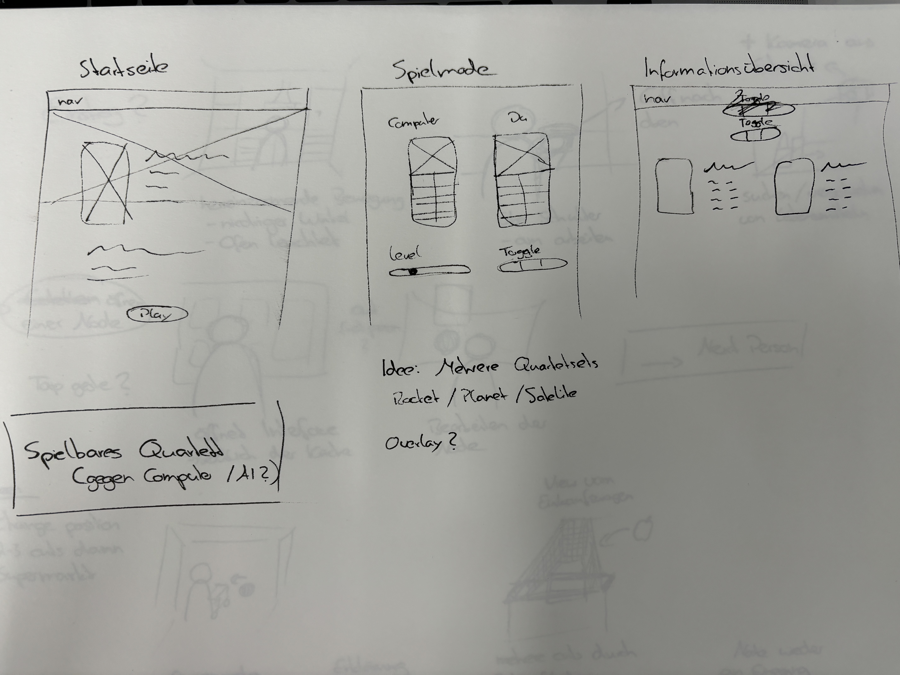
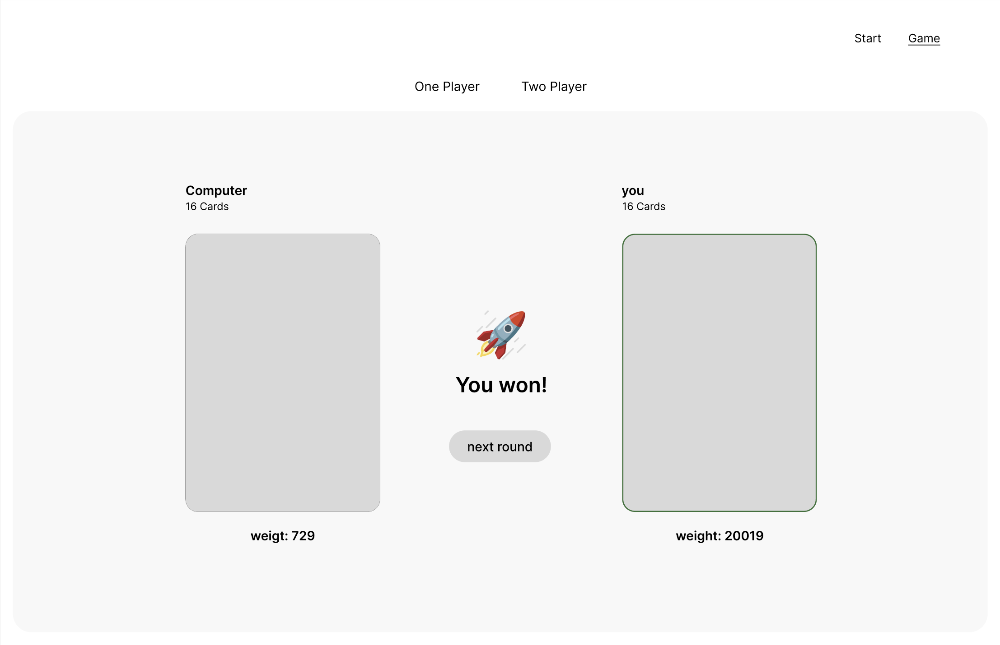
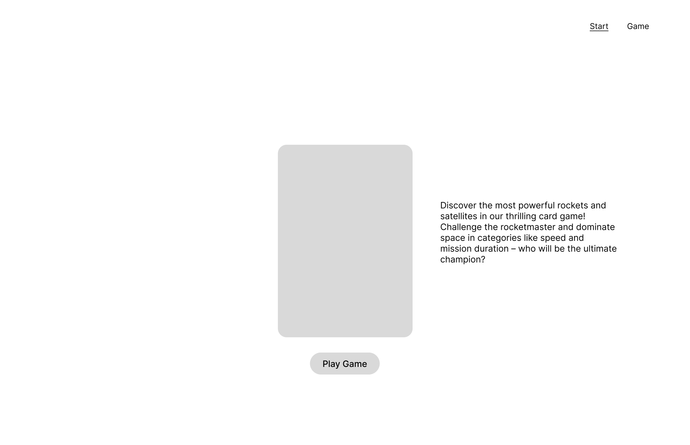

# Space Quartet Spiel
### Übersicht
Space Quartet ist ein interaktives Kartenspiel, das mit Svelte entwickelt wurde. Das Spiel beinhaltet ein Kartendeck, bei dem jede Karte eine Rakete mit verschiedenen Statistiken darstellt. Die Spieler wechseln sich ab, um eine Statistik von einer Karte auszuwählen, und der Spieler mit dem höheren Wert für die gewählte Statistik gewinnt die Runde. Das Spiel läuft weiter, bis alle Karten gespielt sind. Dieses Projekt nutzt die API von OpenAI, um interessante Fakten über die ausgewählten Raketen basierend auf den gewählten Statistiken zu generieren.

### Spielregeln
Das Spiel beginnt mit einer gleichen Anzahl von Karten, die auf zwei Spieler verteilt werden: den Computer und den menschlichen Spieler.
In jeder Runde wählt ein Spieler eine Statistik von seiner obersten Karte.
Die gewählte Statistik wird mit der entsprechenden Statistik des Gegners verglichen.
Der Spieler mit dem höheren Wert gewinnt die Runde und nimmt beide Karten.
Wenn die Werte gleich sind, ist es ein Unentschieden, und beide Karten werden an die jeweiligen Decks zurückgegeben.
Das Spiel läuft weiter, bis alle Karten gespielt sind.

### Features
- Interaktives Gameplay: Zwei Spieler (ein Mensch und ein Computer) wechseln sich ab, um Statistiken aus ihren jeweiligen Decks auszuwählen.
- OpenAI-Integration: Generiert interessante Fakten über die Raketen basierend auf der ausgewählten Statistik.
- Dynamische UI: Echtzeit-Updates und Animationen zur Verbesserung der Benutzererfahrung.
- Spielmöglichkeit gegen den Computer

## Erstellungsprozess
### Erste Zeichnungen

### Wireframes

